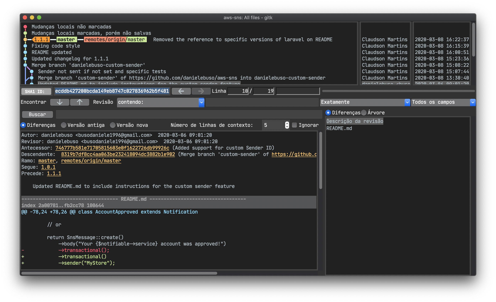

# Material Dark Theme for [gitk](https://git-scm.com/docs/gitk)

> A dark theme for [gitk](https://git-scm.com/docs/gitk).

## Install

All instructions can be found at [installation instructions](./INSTALL.md).

## Team

This theme is maintained by the following person(s) and a bunch of [awesome contributors](https://github.com/claudsonm/gitk-material-dark-theme/graphs/contributors).

 |
--- |
[Claudson Martins](https://github.com/claudsonm) |

## License

[MIT License](./LICENSE)
